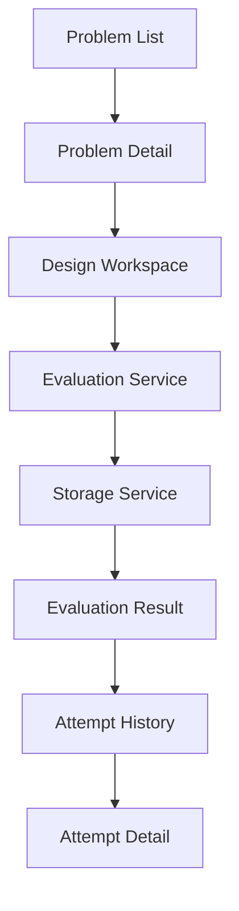

# LLD Practice Platform

## Overview

LLD Practice Platform is a small, focused web app for practicing
Low-Level Design (LLD) interview problems. A learner picks a problem,
reads its requirements, defines a class design (classes,
responsibilities, fields, methods, and relationships), writes a short
explanation of their reasoning, and submits it for feedback. The
submission is scored by a deterministic, rule-based evaluator across
six weighted categories, and every attempt is saved locally so the
learner can review it later or try the same problem again.

It's a two-day take-home MVP, built deliberately small: a monolithic
client-only React app, no backend, no authentication, and a
rule-based evaluator instead of a live AI grader — see
[Evaluation Approach](#evaluation-approach) for why.

## Problem

LLD interview practice is usually unstructured: read a prompt, sketch
some classes on a whiteboard or in a doc, and hope the feedback (if
any) is useful. There's rarely a fast, consistent way to check "did I
cover the core entities, the right kind of relationships, and can this
design actually be extended?" This platform gives that loop a
concrete shape — structured input instead of a blank page, and
immediate, specific, repeatable feedback instead of none.

## MVP Features

- LLD problem practice across 4 problems (Parking Lot, Elevator
  System, Vending Machine, Library Management)
- Structured class design (classes, responsibilities, fields, methods)
- Structured relationships (Association, Aggregation, Composition,
  Inheritance) between classes
- A free-text design explanation field
- Deterministic, rule-based evaluation
- A six-category score breakdown out of 100
- Actionable, specific feedback (strengths, missed considerations,
  suggestions)
- Attempt history per problem
- Read-only review of any past attempt, including its original score
- Persistence via `localStorage` — no account, no backend

## Tech Stack

- React
- Vite
- JavaScript
- React Router
- CSS Modules (plain CSS, no Tailwind, no CSS-in-JS)
- localStorage
- Vitest
- Testing Library (`@testing-library/react`)
- Git/GitHub

## User Flow

```
Problem List
   → Problem Detail
      → Design Workspace
         → Submit
            → Evaluation (evaluationService)
               → Saved as an Attempt (storageService)
                  → Evaluation Result
                     → Attempt History
                        → Attempt Detail (read-only)
```

From the result page or the problem page, a learner can also jump
straight to Attempt History, and from there into any past Attempt
Detail — without re-running the evaluator.

## Architecture

The app is a single-page React app with four layers:

- **UI — pages & components** (`src/pages`, `src/components`): routed
  screens and the presentational pieces they're built from. Pages own
  their own local state (`useState`) — there's no Redux or Context;
  state that multiple sibling components need (e.g. the design
  workspace's classes/relationships) lives in the parent page and is
  passed down as props.
- **Problem data configuration** (`src/data/problems.js`): the 4 LLD
  problems, each with its statement, requirements, and an
  `evaluationCriteria` object the evaluator reads. Adding a 5th
  problem means adding data here, not changing any page or component.
- **Evaluation service** (`src/services/evaluationService.js`): a
  pure, deterministic scoring function. Takes a problem and a
  submission, returns a score breakdown and feedback. No React, no
  DOM, no storage — fully unit-testable in isolation.
- **Storage service** (`src/services/storageService.js`): the only
  code that touches `localStorage`. Reads and writes a single
  `lld_attempts` key and fails safely on malformed data.



The architecture rule kept throughout: **pages call the services, the
services never know about React**, and evaluation only ever happens
once, at submission time — result and detail pages read a stored
evaluation, they never recompute one.

## Evaluation Approach

Submissions are scored out of 100 across six weighted categories:

| Category | Points |
|---|---|
| Core Entities | 25 |
| Relationships | 20 |
| Responsibilities | 20 |
| Extensibility | 15 |
| Design Explanation | 10 |
| Completeness | 10 |

The evaluator is **deterministic and rule-based**, not an LLM call.
For a two-day MVP, that trade-off was chosen deliberately:

- **Deterministic** — the same problem and submission always produce
  the same score, which is testable and explainable in a way a live
  model call isn't.
- **Explainable** — every point awarded or withheld traces back to a
  specific, statable rule (e.g. "matched 4 of 6 expected core
  entities"), not a black-box judgment.
- **Fast** — scoring is synchronous and instant; there's no network
  round-trip or latency to design around.
- **No API dependency** — no API key, no cost per submission, no
  failure mode where grading is unavailable because a third-party
  service is down.
- **Easy to test** — as a pure function, every category and edge case
  (missing data, malformed input) has a direct, fast unit test — see
  [Testing](#testing).

### Extensibility Evaluation

Extensibility (15 points) is deliberately **not** scored from keyword
matching alone. It combines:

- **Submitted structure** — does the design actually contain
  inheritance or another separation-of-concerns pattern?
- **Relationships** — specifically, whether an `Inheritance`
  relationship connects classes that represent variants of a concept.
- **Explanation** — does the learner's written reasoning mention
  extensibility, and if so, is it corroborated by the structure above?
- **Problem-specific criteria** — each problem's
  `evaluationCriteria.extensibilitySignals` supplies relevant terms,
  but a match earns only limited credit unless the design itself
  backs it up. An explanation full of "strategy pattern" and
  "interface" with no supporting classes or relationships scores low,
  not high.

## Data Model

- **Problem** — `id`, `title`, `difficulty`, `shortDescription`,
  `statement`, `functionalRequirements[]`, `nonFunctionalRequirements[]`,
  `evaluationCriteria` (the evaluator's per-problem configuration).
- **DesignClass** — `id`, `name`, `responsibilities[]`, `fields[]`,
  `methods[]`.
- **Relationship** — `fromClassId`, `toClassId`, `type` (Association /
  Aggregation / Composition / Inheritance), `description`.
- **Attempt** — `id`, `problemId`, `createdAt` (ISO timestamp),
  `classes[]`, `relationships[]`, `designExplanation`, `evaluation`
  (the full stored `EvaluationResult`).
- **EvaluationResult** — `score` (0–100), `categoryScores` (six
  `{ score, max, feedback[] }` objects), `strengths[]`,
  `missedConsiderations[]`, `suggestions[]`.

## Local Storage

All attempts are stored under a single `localStorage` key,
`lld_attempts`, as a JSON array of `Attempt` objects — not one key
per problem. `storageService.saveAttempt()` always **appends**, so
every past attempt for every problem is preserved; nothing is
overwritten when a new attempt is submitted, and attempt history
filters by `problemId` at read time rather than by key. Malformed or
missing localStorage data is treated as an empty array rather than
crashing the app.

## Testing

The test suite uses **Vitest**, with **Testing Library**
(`@testing-library/react`) for the two page-level component tests.
As of this commit:

- **23 tests passing, across 5 test files** (`npm run test`)
  - `evaluationService.test.js` — 8 tests (scoring behavior, edge
    cases, malformed input)
  - `storageService.test.js` — 5 tests (persistence, filtering,
    malformed localStorage)
  - `sortAttempts.test.js` — 2 tests (pure sort helper)
  - `AttemptHistoryPage.test.jsx` — 4 tests (filtering, sort order,
    empty state, invalid problem)
  - `AttemptDetailPage.test.jsx` — 4 tests (valid load, stored-vs-
    recalculated score, invalid attempt, mismatched problem)

Service-layer tests run in Vitest's default Node environment for
speed; the two page-level test files opt into a jsdom environment
per-file (`// @vitest-environment jsdom`) only where actual DOM
rendering is needed.

## AI Usage

AI tools (Claude) were used throughout development — architecture
planning, code generation, and drafting this documentation. Every
AI-assisted suggestion was reviewed, tested, and in several cases
rejected or modified by the developer before being accepted; nothing
here was merged unreviewed. See [AI_USAGE.md](./AI_USAGE.md) for
specific, documented decisions.

## Known Limitations

- No backend or database — everything is client-side and
  `localStorage`-only, so attempts don't sync across devices or
  browsers and are lost if storage is cleared.
- No authentication — there's no concept of a user account.
- The evaluator is heuristic and rule-based, not a semantic/LLM
  reviewer — it can miss nuance a human (or an LLM) grader would
  catch, in exchange for being deterministic and explainable.
- The problem catalog is limited to 4 problems.
- Relationship semantics are simplified for the MVP: relationship
  matching is direction-agnostic (an expected `A → B` pattern matches
  either arrow direction), which is a simplification of real UML
  semantics.

## Future Improvements

The following are explicitly **not implemented** — they're ideas for
where this could go next, not current features:

- An optional LLM-assisted qualitative review layered on top of the
  deterministic score
- Backend persistence (so attempts sync across devices)
- Authentication / user accounts
- More LLD problems
- Richer UML-style visualization of the submitted design
- Teacher/admin review and feedback tools
- Usage analytics

## Getting Started

```bash
npm install
npm run dev
```

Build and test:

```bash
npm run build
npm run test
```

## Deployment

Not currently deployed. Run locally with the commands above.
